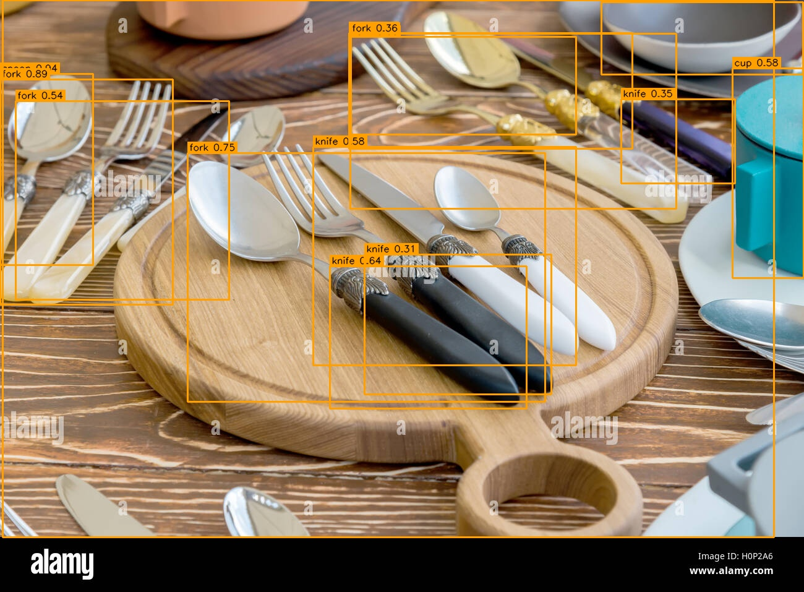
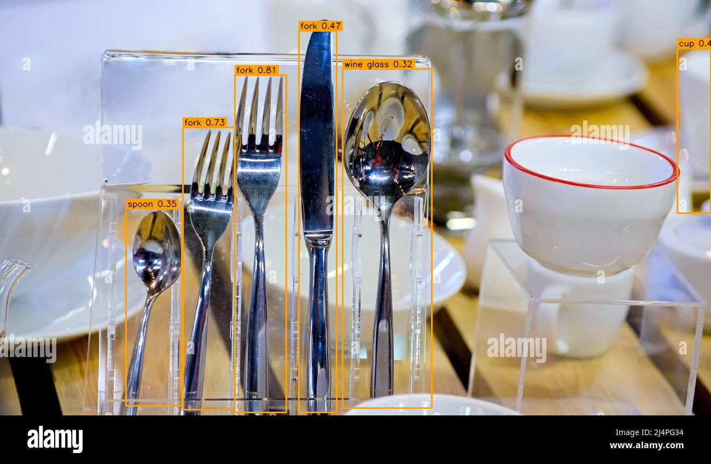

# 🧠 YOLOv8 Object Detection — Images · Video · Webcam

This repo provides a clean, modular, and beginner-friendly YOLOv8 object detection pipeline using **Ultralytics YOLOv8** + **OpenCV**, with scripts for:

- Image inference  
- Video inference  
- Live webcam detection  
- MP4 recording  
- Easy annotation utilities  

Everything is structured exactly like a production-ready CV toolkit.

---

# 📸 Preview (Output Examples)

### **Image Detection**



### **Video Detection (Annotated MP4)**


### **Webcam Detection (Live View + Recording Support)**


*(Replace these with your real outputs once generated.)*

---

# ⚡ Quickstart

## ** Install dependencies**
```bash
pip install -r requirements.txt
```
## 🖼️ **Run Image Inference**
```bash
python scripts/detect_image.py samples/input.jpg outputs/detected_image.jpg
```
## 🖼️ **Run Video Inference**
```bash
python scripts/detect_video.py samples/test.mp4 outputs/detected_video.mp4
```
## 🖼️ **Run Webcam Detection (press q to quit)**
```bash
python scripts/detect_webcam.py
```
## 🖼️ **Record webcam output to MP4**
```bash
python scripts/detect_webcam.py outputs/webcam_record.mp4
```

---


# 📁 Project Structure
```text
yolov8-object-detection/
│
├── scripts/
│   ├── detect_image.py          # Image inference
│   ├── detect_video.py          # Video inference + MP4 writer
│   ├── detect_webcam.py         # Live detection + optional MP4 recording
│   └── utils.py                 # Shared helpers (annotation, model loading)
│
├── samples/
│   ├── input.jpg                # Example image
│   └── input.mp4                 # Example video
│
├── outputs/                     # All generated detections saved here
│   ├── detected.jpg                # Example image
│   └── detected.mp4                 # Example video
│
├── models/ (optional)           # Place custom YOLO weights (yolov8s.pt, custom.pt)
│
└── README.md
```

---

# 🧩 How Detection Works

- Load YOLOv8 model (Ultralytics API)
- Run inference on each frame (image / video / webcam)
- Extract detections:
    - Bounding boxes
    - Class IDs
    - Confidence scores
- Annotate frame with OpenCV rectangles + labels
- Save output (image or MP4 video)
    - Webcam mode can record automatically

---

## ⚙️ Switching YOLO Models (Accuracy vs Speed)

| Model        | Speed        | Accuracy | Best For              |
|--------------|--------------|----------|------------------------|
| **yolov8n.pt** | ⚡ Very Fast  | Medium   | Real-time webcam       |
| **yolov8s.pt** | Fast         | Better   | General use            |
| **yolov8m/l.pt** | Medium       | High     | Projects / demos       |
| **yolov8x.pt** | Slow         | 🔥 Highest | Research / heavy tasks |

---

## 🚀 Features at a Glance (Why This Repo Is Useful)

```text
✅ Works on images, videos, webcam
✅ MP4 recording built-in
✅ Switch models instantly (nano → xlarge)
✅ Pure Python + OpenCV + Ultralytics
✅ Zero boilerplate — clean reusable scripts
✅ Auto-create folders & safe file handling
✅ Beginner-friendly structure but production-ready
```

## 🛠️ Under the Hood — Pipeline Breakdown

Every script in this repo follows the same high-level pipeline:
```bash
Frame → YOLO Inference → Parse Boxes → Annotate → Save/Display
```
# 🔍 Step-by-Step YOLOv8 Detection Pipeline

This section explains exactly how every script in this repo works internally — from reading a frame to generating fully annotated detections.

---

## 🧵 **Full Pipeline (Frame → YOLO → Annotation → Output)**

1️⃣ **Read a frame**
- From image / video / webcam

2️⃣ **Convert color space**
- OpenCV uses **BGR**
- YOLOv8 internally converts to **RGB**

3️⃣ **Run YOLOv8 inference**
```python
results = model.predict(source=frame, conf=0.25, imgsz=640)
```

4️⃣ **Extract Detections**
- **boxes** → `[x1, y1, x2, y2]`
- **scores** → confidence values
- **class_ids** → category indices (0–79 for COCO dataset)

5️⃣ **Annotate Frame**
- Draw bounding boxes on detected objects  
- Render label + confidence score  
- Apply color overlays for visibility  

6️⃣ **Output**
- **Images** → save annotated `.jpg`  
- **Videos** → write annotated `.mp4`  
- **Webcam** → display live stream (+ optional MP4 recording)

This modular design keeps the YOLOv8 pipeline clean, reusable, and production-ready.

---

### 🧬 What YOLOv8 Actually Does (Under the Hood)

YOLOv8 is a **one-stage detector**, engineered for high speed and strong accuracy.

#### 🧱 Backbone
- Deep **CSP/Conv** layers  
- Extracts multi-scale hierarchical visual features  
- Learns textures, edges, shapes, objects

#### 🚧 Neck
- **PAN / FPN** feature fusion  
- Merges **low-level detail** with **high-level semantics**  
- Crucial for detecting **both tiny and large** objects

#### 🎯 Detection Head (Decoupled)
- **Objectness score** → "Is there an object here?"  
- **Class probabilities** → "What object is it?"  
- **Bounding box regression** → precise box coordinates  

#### ⚡ Why YOLOv8 Is Extremely Fast
- **Single forward pass** (one-shot detection)  
- **No region proposals** (unlike Faster R-CNN)  
- Highly optimized GPU kernels  
- **Anchor-free** detection → simpler + faster  
- Layer fusion similar to TensorRT acceleration  

YOLOv8 balances **speed, accuracy, and simplicity**, making it ideal for real-time applications.

---

### 🎛️ Parameter Tuning (Speed ↔ Accuracy)

**Increase accuracy**
```python
model = load_model("yolov8l.pt")
results = model.predict(frame, conf=0.20)
```
**Increase speed**
```python
model = load_model("yolov8n.pt")
results = model.predict(frame, imgsz=480)
```

**Reduce false positives**
```python
results = model.predict(frame, conf=0.35)
```

**Detect smaller objects better**
```python
results = model.predict(frame, conf=0.20, imgsz=960)
```

---

## 📊 Supported Classes (COCO-80)

YOLOv8 models (n/s/m/l/x) detect 80 common classes, including:

- Person
- Car, truck, bus, motorcycle
- Dog, cat, horse
- Bottle, cup, bowl
- Laptop, keyboard, phone
- Chair, couch, bed
- Traffic light, stop sign
- And many more…

Print the full class list:
```python
print(model.model.names)
```

---

### 🧩 Extensions You Can Build on Top of This Repo

Take this project from simple **object detection** to a full **computer vision system** by adding any of these modules:

---

#### 🔹 A. DeepSORT Object Tracking  
Assign unique IDs to each object and track them across frames.  
Useful for: pedestrians, vehicles, sports analytics, robotics.

---

#### 🔹 B. Zone Monitoring / Intrusion Detection  
Draw polygonal zones and trigger alerts when objects enter them.  
Perfect for:  
- Factory floor safety  
- Smart CCTV  
- Restricted access areas  

---

#### 🔹 C. People Counting  
Count how many people cross a virtual line (“line crossing analytics”).  
Used in: malls, public transport, event monitoring.

---

#### 🔹 D. Face Blurring / Privacy Mode  
Automatically detect & blur human faces from YOLO + OpenCV.  
Important for privacy compliance (GDPR-like requirements).

---

#### 🔹 E. Multi-Class Color Coding  
Use different bounding box colors per object class for better visualization.  
Example:  
- Person → green  
- Vehicle → blue  
- Animal → orange  

---

#### 🔹 F. Real-Time Speed Estimation  
Track object movement distance between frames to estimate speed.  
Useful for:  
- Traffic analytics  
- Sports performance tracking  
- Robotics navigation  

---

### 🧪 Benchmark Performance (Real Numbers)

Use this quick snippet to measure inference FPS:

```python
import time
t0 = time.time()
results = model.predict(frame)
fps = 1 / (time.time() - t0)
print(f"FPS: {fps:.2f}")
```

---

## 🚀 Why This Repo Is Valuable (For Your Career)
```text
This repo demonstrates:

✔ Ability to structure ML/CV code professionally
✔ Understanding of YOLO pipelines
✔ Ability to process image, video, and real-time streams
✔ Practical debugging, annotation, and visualization
✔ Production-ready usage of OpenCV + Ultralytics
```

---
